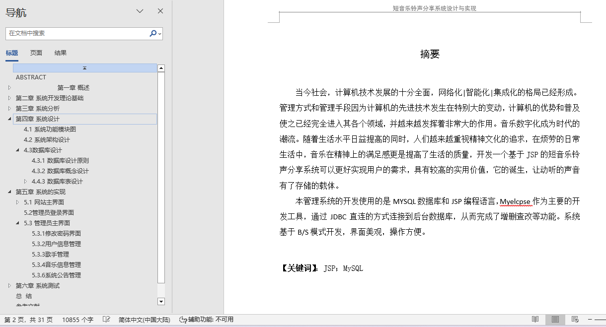
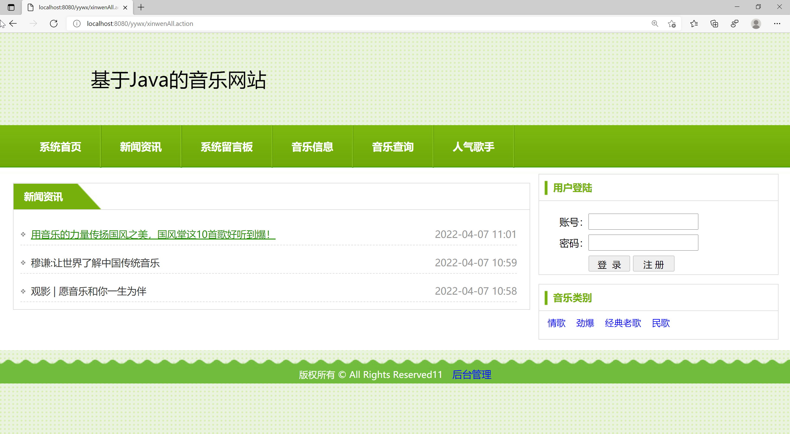
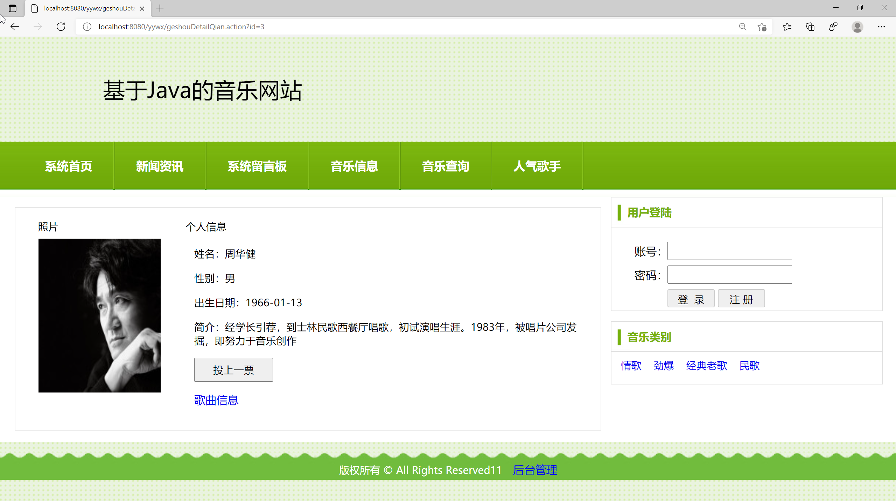
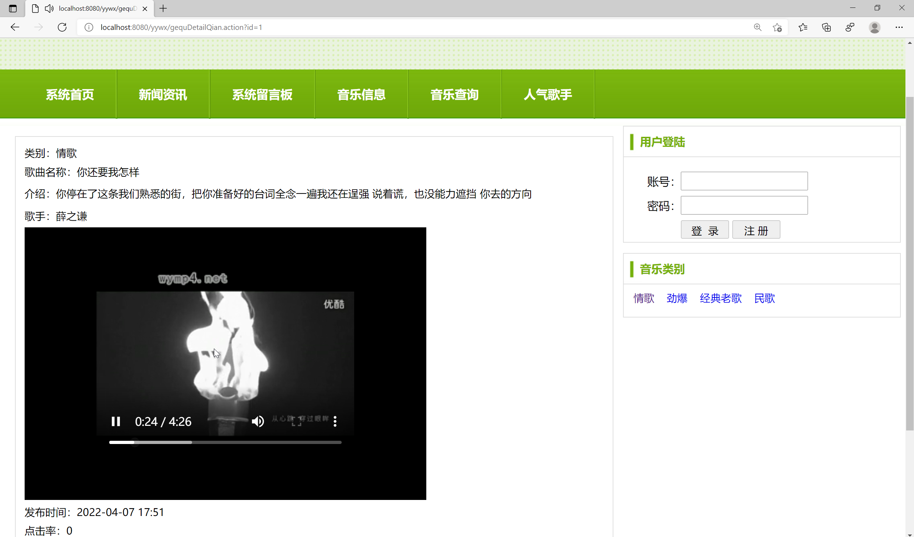
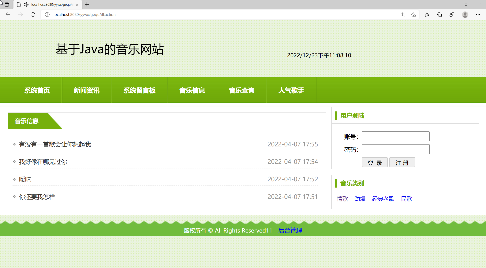
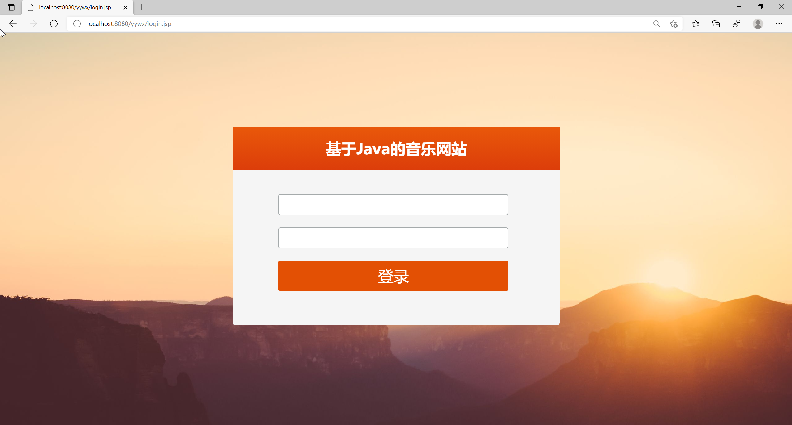
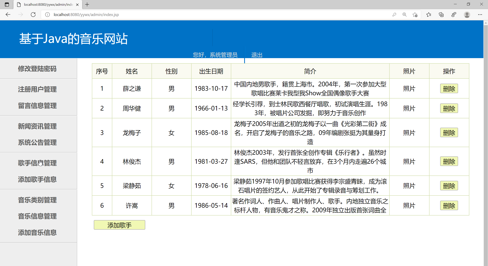
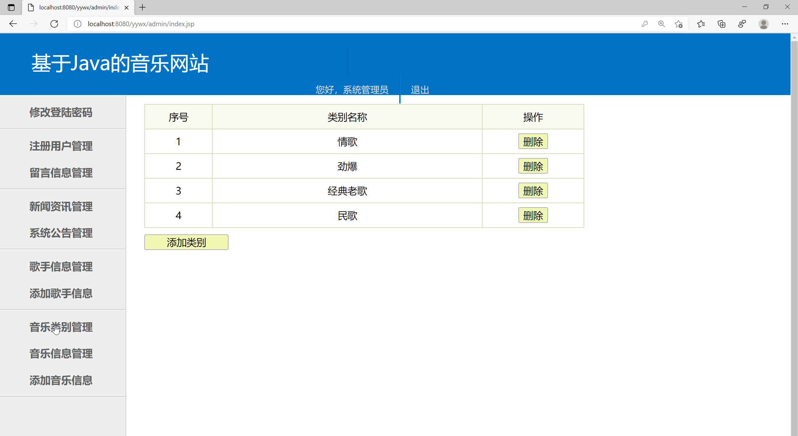
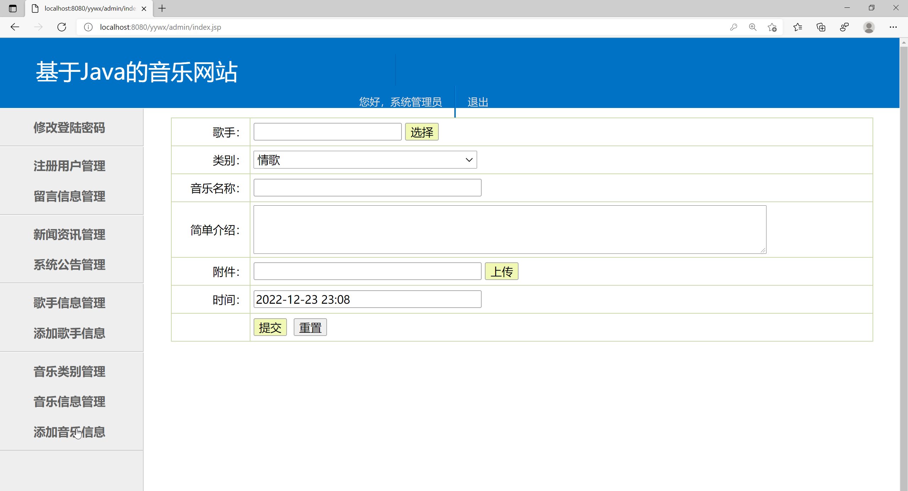
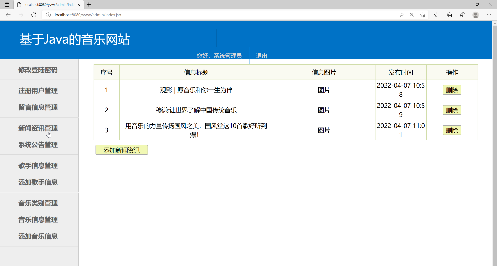

## 基于JSP+Servlet实现的音乐网站系统(程序+报告)

- <b>完整代码获取地址：从戎源码网 ([https://armycodes.com/](https://armycodes.com/))</b>
- <b>技术探讨、资料分享，请加QQ群：692619798</b> 
- <b>作者微信：19941326836  QQ：952045282</b> 
- <b>承接计算机毕业设计、Java毕业设计、Python毕业设计、深度学习、机器学习</b>
- <b>选题+开题报告+任务书+程序定制+安装调试+论文+答辩ppt 一条龙服务</b>
- <b>所有选题地址 ([https://github.com/YuLin-Coder/AllProjectCatalog](https://github.com/YuLin-Coder/AllProjectCatalog)) </b>

## 项目介绍
基于JSP+Servlet实现的音乐网站系统，主要功能如下

【用户角色】：

1. 系统首页：展示音乐网站的主页，包括系统公告、热门歌手、音乐类别等内容。
2. 新闻资讯：展示音乐行业的最新动态和资讯，包括音乐活动、音乐人访谈、音乐类别等。
3. 系统留言板：用户可以在留言板上发表自己的意见和建议，与其他用户进行交流和讨论。
4. 音乐信息：展示音乐分类、音乐专辑等相关信息。
5. 音乐查询：用户可以通过歌曲名称或歌手名称进行音乐的查询，并显示歌曲的详细信息。
6. 人气歌手：展示当前最受欢迎的歌手，包括其个人资料、代表作品等。

【管理员角色】：

1. 修改登录密码：管理员可以修改自己的登录密码。
2. 注册用户管理：管理员可以查看、编辑和删除注册用户的信息，包括用户名、密码、邮箱等。
3. 留言信息管理：管理员可以查看、回复和删除用户在留言板上的留言信息。
4. 新闻资讯管理：管理员可以添加、编辑和删除新闻资讯，包括标题、内容、发布日期等。
5. 系统公告管理：管理员可以发布系统公告，包括重要通知、网站更新等内容。
6. 歌手信息管理：管理员可以查看、编辑和删除歌手的个人资料，包括姓名、性别、出生日期等。
7. 添加歌手信息：管理员可以添加新的歌手信息，包括姓名、性别、出生日期等。
8. 音乐分类管理：管理员可以添加、编辑和删除音乐的分类信息，方便用户进行音乐查询。
9. 音乐信息管理：管理员可以查看、编辑和删除音乐的详细信息，包括歌曲名称、歌手、专辑等。
10. 添加音乐信息：管理员可以添加新的音乐信息，包括歌曲名称、歌手、专辑等。

## 项目技术
- 编程语言：Java
- 数据库：MySQL
- 前端技术：JSP、JavaScript、bootstrap、JQuery
- 后端技术：Servlet、JDBC

## 运行环境
- JDK版本：JDK1.8及以上
- 开发工具：IDEA、Ecplise、Myecplise都可以
- 数据库: MySQL5.7及以上

## 运行截图

